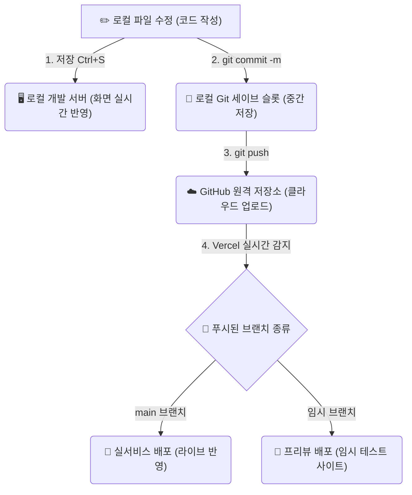

# 🎮 Git & Vibe Coding 종합 개념 가이드

이 문서는 Git의 핵심 개념(로컬, 원격, 커밋, 푸시, 브랜치, 병합)과 이를 **AI 어시스턴트에게 편하게 명령하는 방법(Vibe Coding)**을 한눈에 볼 수 있도록 정리한 가이드입니다. 

---

## 💡 Git 핵심 개념: 게임에 비유하기

Git의 작동 방식은 비디오 게임의 **세이브 파일(저장 데이터) 관리**와 완벽히 똑같습니다.

### 1. 저장 (Ctrl + S)
* **게임 비유**: 게임 플레이 중 임시로 메모리에 저장된 상태.
* **설명**: 내 컴퓨터 하드디스크의 텍스트 파일을 수정하여 저장하는 행위입니다. **로컬 개발 서버는 이 저장만 감지해도 화면을 즉시 업데이트**해 주므로 테스트할 때는 커밋할 필요 없이 저장만으로 충분합니다.

### 2. 커밋 (Commit)
* **게임 비유**: **"수동 세이브 슬롯 작성"** (예: 슬롯 1번 - 보스전 직전 세이브)
* **설명**: 내 의도나 기획 단위가 완료되었을 때, 내 컴퓨터(로컬) Git에 **메모(커밋 메시지)**와 함께 버전 기록을 남기는 행동입니다. 언제든 이 시점으로 불러오기(Load)를 할 수 있는 이정표가 됩니다.

### 3. 푸시 (Push)
* **게임 비유**: 내 컴퓨터에 있는 **세이브 파일을 클라우드 서버에 업로드**하기.
* **설명**: 로컬의 커밋 기록들을 원격 저장소인 **GitHub(깃헙)**으로 전송하는 작업입니다. 인터넷 연결이 필요하며, 푸시를 해야 비로소 남들과 공유하거나 배포 서비스가 이를 인식할 수 있습니다.

### 4. 브랜치 (Branch)
* **게임 비유**: 하나의 게임 세이브 파일에서 갈라져 나오는 **"멀티 엔딩 루트 (평행 우주)"**
* **설명**: 안전한 개발을 위해 기존 메인 역사(`main` 브랜치)에 영향을 주지 않는 독립적인 작업 공간을 만드는 것입니다. 과거 시점이나 현재 시점 언제든 가지치기가 가능합니다.

### 5. 머지 / 병합 (Merge)
* **게임 비유**: 평행 우주에서 획득한 특수 아이템과 능력을 다시 본래의 우주로 가져와 **"합치기"**
* **설명**: 따로 개발하던 브랜치의 코드 변경사항들을 대상 브랜치(보통 `main`)에 합치는 작업입니다.

### 6. 풀 리퀘스트 (Pull Request, PR)
* **게임 비유**: 합치기 전에 스태프들에게 **"이 평행 우주 결과물 본체에 합쳐도 될까요?" 결재판 올리기**
* **설명**: GitHub 웹사이트에서 제공하는 기능으로, 내 브랜치의 변경사항을 메인 브랜치에 합치기 전에 팀원들과 코드를 리뷰하고 자동 배포 테스트를 거치기 위한 제안서입니다.

### 7. 리버트 / 롤백 (Revert / Rollback)
* **게임 비유**: 최신 세이브 파일에 버그가 생겨서 **"이전 세이브 슬롯을 불러와 덮어쓰기"**
* **설명**: 이미 병합되거나 푸시된 특정 커밋을 취소하기 위해, 그 커밋의 반대 작업을 수행하는 새로운 커밋을 추가하여 역사를 안전하게 되돌리는 방법입니다.

---

## 📋 터미널 명령어 vs Vibe Coding(말하듯 요청하기) 매핑

터미널에 명령어를 직접 치는 대신, AI에게 자연스럽게 요청할 때(Vibe Coding)의 매핑 테이블입니다. **(AI 요청 시 구체적인 커밋 메시지를 일일이 설명할 필요 없이 "알아서"라고 시키는 것이 가장 효율적입니다.)**

| 기능 (Git 역할) | 💻 터미널 명령어 | 🗣️ AI 바이브 코딩 요청 예시 |
| :--- | :--- | :--- |
| **코드 로컬 수정** | *(단순 텍스트 편집 및 저장)* | `"~ 기능 추가해줘"`, `"~ 에러 고치고 저장해줘"` |
| **커밋 생성 (알아서)** | `git add .` `git commit -m "Auto description"` | **`"알아서 커밋해줘"`**, `"지금까지 한 거 중간 저장(커밋)해줘"` |
| **수동 메시지 커밋** | `git commit -m "Fix: layout"` | `"음소거 추가한 내용으로 커밋해줘"` |
| **원격 업로드 (배포)** | `git push origin main` | **`"깃헙에 푸시해줘"`**, `"라이브 배포 진행해줘"` |
| **임시 테스트 브랜치 생성** | `git checkout -b test-branch` | `"테스트용 임시 브랜치 새로 만들어줘"` |
| **히스토리 확인** | `git log --oneline` | **`"깃 로그 보여줘"`**, `"커밋 목록 보여줘"` |
| **완전 취소 (코드 삭제)** | `git reset --hard HEAD~1` | **`"방금 한 거 다 취소해줘"`**, `"방금 커밋 취소하고 코드도 싹 지워줘"` |
| **커밋만 취소 (코드 보존)** | `git reset --soft HEAD~1` | `"방금 커밋은 취소해주되 코드 파일은 그대로 남겨줘"` |
| **원격 동기화 (최신 받기)** | `git checkout main` `git pull` | `"메인 브랜치 최신 상태로 로컬 싱크 맞춰줘"` |

---

## ⚡ Vercel 자동 배포의 흐름 (GitHub 연동)

Vercel은 GitHub 저장소를 감시하고 있으며, 브랜치 종류에 따라 다르게 빌드합니다.

1. **`main` 브랜치에 코드가 올라갈 때 (Push 또는 PR Merge)**
   * **버셀의 행동**: "공식 릴리즈다!" ➡️ 실제 서비스 도메인(라이브 사이트)에 즉시 빌드 및 배포 반영.
2. **그 외 임시 브랜치에 코드가 올라갈 때 (Push)**
   * **버셀의 행동**: "개발 중인 테스트 버전이군." ➡️ **Preview(프리뷰) 임시 테스트 URL**을 생성. (깃헙 PR 페이지에서 링크 제공)
   * **용도**: 실서비스 사용자들에게 영향 없이, 오직 개발자만 임시 주소로 들어가서 기능을 완벽하게 실시간 테스트해볼 수 있음.

---

## 💡 AI 토큰 & 시간 절약 꿀팁

AI를 사용할 때 토큰(비용)과 대화 속도를 대폭 아끼는 **가장 스마트한 워크플로우**입니다.

1. **로컬 테스트 우선**: 
   * 수정할 때마다 매번 깃헙에 올리고 라이브 배포를 기다리지 마세요. 로컬 서버(`npm run dev` 등)를 켜놓고 화면 변화를 직접 마우스로 클릭하며 테스트하세요. 이 과정은 AI 토큰 소모가 전혀 없습니다.
2. **일괄 요청 (Batching)**: 
   * "오타 수정 ➡️ 배포 ➡️ 확인 ➡️ 다른 거 수정 ➡️ 배포"식으로 쪼개서 질문하면 대화 기록이 길어져 토큰이 급증합니다.
   * 수정해야 할 기획들을 메모장에 모아두었다가 **"1. 버튼 추가, 2. 글꼴 변경, 3. 간격 수정 한 번에 해줘"**와 같이 목록으로 묶어서 요청하세요.
3. **단순 깃 명령어는 직접 치기**: 
   * `git status`, `git pull`, `git push` 같은 간단한 명령어들은 사용자가 터미널에 직접 입력하는 습관을 들이면 대화 횟수가 줄어들어 토큰을 최대로 아낄 수 있습니다.
