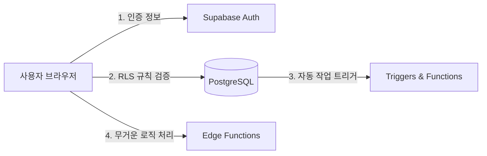

# ⚡ Supabase 쿼리 최적화 및 고급 활용 가이드

Supabase는 백엔드를 몰라도 관계형 데이터베이스인 **PostgreSQL**의 강력한 기능을 그대로 활용할 수 있게 돕는 도구입니다. 데이터베이스 성능을 극대화하고, Egress(전송량) 비용을 절약하며, 비개발자로서 AI(Vibe Coding)를 활용해 고급 레벨로 빌드하는 아키텍처 가이드를 제공합니다.

---

## 📌 Part 1. Supabase 쿼리 최적화 기법 (Egress 절약의 핵심)

가장 흔하게 전송량(Egress)이 낭비되는 원인은 **필요 이상의 데이터를 요청하거나 수백 번 중복 호출하기 때문**입니다. 이를 방지하는 대표적인 4가지 쿼리 최적화 기법입니다.

### 1) 필요한 열(Column)만 골라서 가져오기
전체 데이터(`*`)를 다 긁어오는 것은 네트워크 대역폭 낭비의 주범입니다.
* ❌ **비효율적인 예시**:
  ```javascript
  // 모든 컬럼(본문 텍스트, 이미지 URL 등 무거운 데이터 포함)을 전부 다운로드
  const { data } = await supabase.from('posts').select('*');
  ```
* 🎯 **최적화 예시**:
  ```javascript
  // 화면 표시용 아이디와 제목만 골라서 다운로드 (Egress 소모 대폭 감소)
  const { data } = await supabase.from('posts').select('id, title');
  ```

### 2) 페이징(Pagination) 처리 필수 적용
데이터가 1,000개 쌓였을 때 한 화면에 다 불러오지 않고, 10개나 20개씩 쪼개서 불러오는 방식입니다.
* 🎯 **구현 예시 (Supabase JavaScript)**:
  ```javascript
  const PAGE_SIZE = 10;
  const page = 0; // 1번째 페이지 (0부터 시작)

  const { data } = await supabase
    .from('posts')
    .select('id, title')
    .range(page * PAGE_SIZE, (page + 1) * PAGE_SIZE - 1); // 0~9번 데이터만 가져옴
  ```

### 3) 데이터베이스 인덱스(Index) 생성하기
책의 '찾아보기(색인)'와 같은 개념입니다. 특정 칼럼(예: 이메일, 작성자 ID)으로 검색할 때, 테이블 전체를 처음부터 뒤지지 않고 단번에 데이터를 찾아내는 명령어입니다.
* 🎯 **SQL Editor 실행 명령어**:
  ```sql
  -- posts 테이블의 author_id 칼럼에 인덱스 생성
  CREATE INDEX idx_posts_author ON posts(author_id);
  ```
  > [!TIP]
  > 자주 `WHERE` 조건절이나 정렬(`ORDER BY`)에 들어가는 칼럼에는 인덱스를 생성해 주면 쿼리 실행 속도가 최대 100배 이상 빨라집니다.

### 4) 데이터베이스 뷰(Database View) 활용하기
서버에서 데이터를 다운받아 프론트엔드(브라우저)에서 복잡하게 연산(예: 합계 계산, 필터링 등)하지 않고, **DB 엔진이 미리 계산해 둔 표(View)를 쿼리**해 전송받는 방식입니다.
* 🎯 **SQL Editor 실행 명령어**:
  ```sql
  -- 복잡한 통계 연산을 처리하는 가상 테이블(뷰) 정의
  CREATE VIEW active_users_summary AS
  SELECT user_id, COUNT(post_id) as total_posts
  FROM posts
  GROUP BY user_id;
  ```
* **프론트엔드 호출**:
  ```javascript
  const { data } = await supabase.from('active_users_summary').select('*');
  ```

---

## 🗂️ Part 2. 개발자들이 주로 쓰는 아키텍처 및 보안 기법

Supabase를 기초 이상(프로덕션 레벨)으로 다룰 때 사용하는 핵심 아키텍처 구성요소입니다.



### 1) RLS (Row Level Security, 행 수준 보안)
프론트엔드에서 데이터베이스를 직접 호출하기 때문에, 사용자가 남의 데이터를 수정하거나 훔쳐보지 못하게 원천 차단하는 DB 보안 기술입니다.
* **개념**: "로그인한 유저가 본인이 쓴 글만 조회/수정할 수 있다"는 보안 룰을 DB 자체에 심어두는 것입니다.
* **SQL 룰 적용 예시**:
  ```sql
  ALTER TABLE posts ENABLE ROW LEVEL SECURITY;

  CREATE POLICY "사용자 본인 글만 수정 가능" 
  ON posts FOR UPDATE 
  USING (auth.uid() = author_id);
  ```

### 2) Database Triggers (트리거)
사용자가 회원 가입을 하면(`Supabase Auth`), 자동으로 `profiles` 테이블에 회원 전용 레코드가 한 줄 생성되도록 DB 안에서 자동화 스위치를 켜두는 기능입니다.
* **장점**: 프론트엔드에서 회원 가입 처리 후 프로필 생성을 직접 호출할 필요가 없어 데이터 유실을 막아줍니다.

### 3) Edge Functions (서버리스 에지 기능)
비밀 키를 프론트엔드에 노출하면 안 되는 중요한 작업(예: 토스페이먼츠 결제 승인 API 호출, 알림톡 발송 등)을 처리하기 위한 가벼운 백엔드 서버 기능입니다. 
* **구동 방식**: 전 세계 사용자 기준 가장 가까운 위치의 CDN 서버에서 초고속으로 작동하는 임시 백엔드 스크립트입니다.

---

## 💬 Part 3. 비개발자를 위한 Supabase Vibe Coding 실전 패턴

비개발자가 AI 코딩 도구(예: Antigravity)를 활용해 Supabase 백엔드를 설계할 때 가장 성공률이 높은 대화(Prompting) 패턴입니다.

### 💡 패턴 1. "DB 테이블 설계도(SQL) 만들어줘"
스스로 테이블을 어떻게 구성할지 고민하지 않고, 구현하고 싶은 비즈니스 요구사항을 그대로 AI에게 설명합니다.
* **🗣️ 프롬프트 예시**:
  > *"가입한 회원들이 게시글을 쓰고 댓글을 다는 커뮤니티 앱을 만들 거야. Supabase SQL 에디터에 그대로 붙여넣을 수 있는 `CREATE TABLE`용 SQL 코드를 짜줘. 회원 ID 연동, 작성 시간 칼럼도 넣어줘."*
* **효과**: AI가 외래키(Foreign Key) 설정과 관계 설정이 다 끝난 완벽한 SQL 스크립트를 작성해 주므로, 복사-붙여넣기만 하면 테이블 설계가 완료됩니다.

### 💡 패턴 2. "보안 룰(RLS) SQL 작성해줘"
가장 어렵게 느끼는 RLS 정책을 AI에게 한글 요구사항으로 처리해 달라고 합니다.
* **🗣️ 프롬프트 예시**:
  > *"내가 회원 가입한 유저들만 자기가 작성한 게시글을 수정 및 삭제할 수 있게 보안 정책(RLS)을 걸고 싶어. Supabase SQL 에디터에 넣을 명령어를 짜줘."*

### 💡 패턴 3. "데이터 전송량 아끼는 쿼리로 변경해줘"
작성한 프론트엔드 코드를 통째로 복사해서 전달하고, 전송량과 호출 횟수를 아끼는 코드로 변환해 달라고 합니다.
* **🗣️ 프롬프트 예시**:
  > *"(코드 복사) 이 화면에서 데이터를 불러오는데 Supabase Egress가 너무 빨리 닳아. 10개씩 끊어 부르고, 필요한 칼럼만 골라오고, 불필요한 중복 새로고침 막아주도록 코드를 리팩토링해줘."*

---

## 🗺️ Part 4. Supabase 마스터로 가는 로드맵

1. **기초**: JS 클라이언트 라이브러리를 사용해 데이터 조회, 삽입, 수정, 삭제(CRUD) 구현.
2. **중급**: 
   * **RLS 보안 설정**: 회원 가입 및 로그인 기능 연동 후 권한 제어.
   * **Realtime**: 실시간 채팅이나 스코어 보드를 위해 데이터 변경 사항 실시간 듣기(Listener).
3. **고급**:
   * **PG Vector**: AI 임베딩 벡터 데이터를 Supabase DB에 저장하고 시맨틱 유사도 검색 구현하기.
   * **DB 백업 및 마이그레이션 도구**: CLI를 사용해 개발용 DB와 서비스용 DB 서버를 완전 분리하고 코드로 반영하기.
